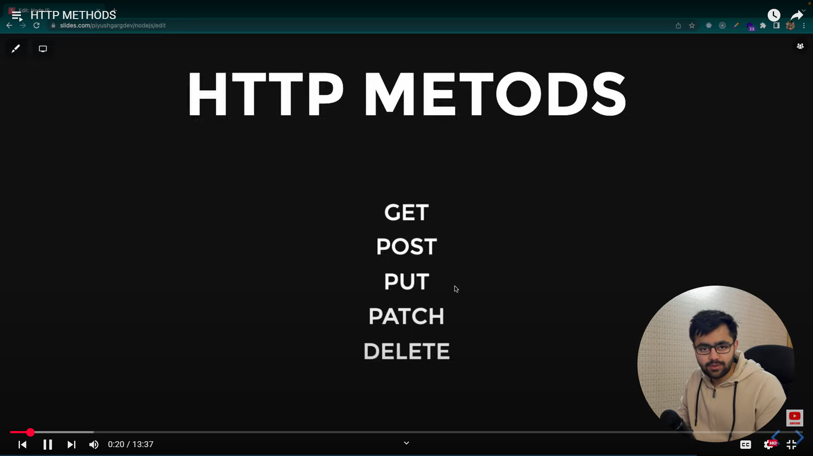
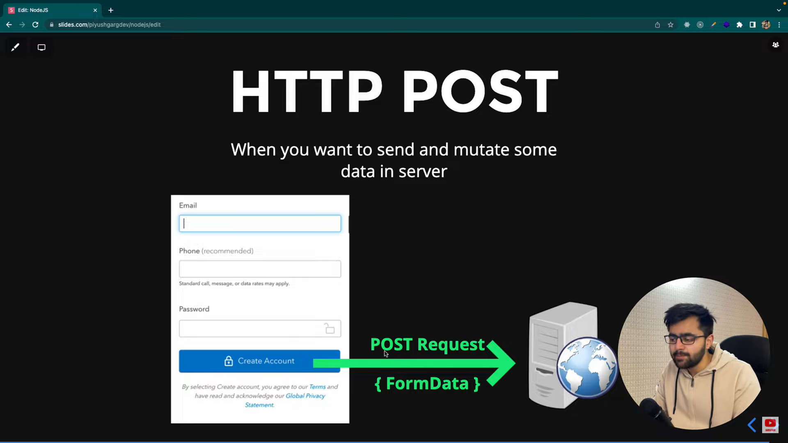

# HTTP Methods

- PUT Method: If you want upload image, video on the server.

- PATCH Method: If you want to update something on the server.

- DELETE Method: If you want to delete something on the server.